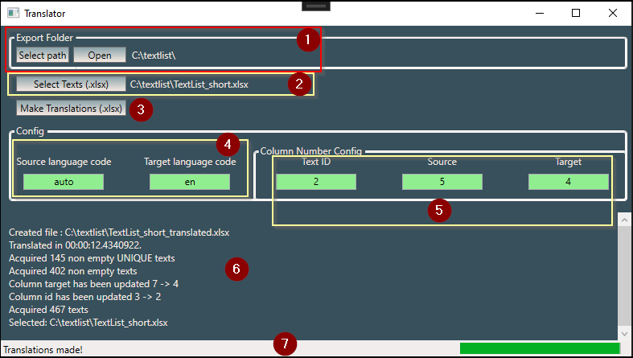

# TranslateApp
\
Simple WPF App that allows to translate texts (Exported textlist from TIA Portal) contained in Excel File\

\
(1) - Select export path, open folder\
(2) - Select excel file with texts to translate\
(3) - Translate texts\
(4), (5) controls background color is green when configuration is ok and red when not ok - configuration is automatically filled and checked after file selection (2)\
(4) - source and target language code\
(5) - column organisation configuration\
(6) - operations information\
(7) - status text with informations for user and progressbar showing translations progress\

